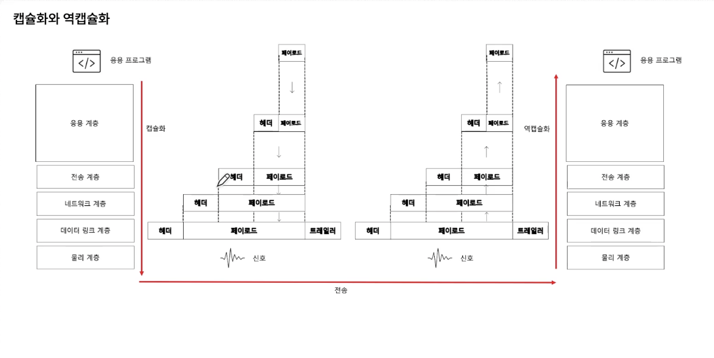

## **Ch 1. 오리엔테이션**

### **01. 네트워크 거시적으로 보기**

#### **컴퓨터 네트워크**
- 여러 장치들이 서로 정보를 주고받을 수 있는 통신망

#### **구성요소**
- 노드, 메세지, 간선(네트워크)

#### **노드**
- 종단 시스템, **호스트**

- **메세지를 최초로 송신, 생성하는 대상**

- 주소를 통해 위치를 특정
    + 유니캐스트 - 1:1
        + 개별 호스트에게 데이터를 전송하는 방식
        + 예시: 개인 메시지, 웹 브라우징
        
    + 브로드캐스트 - 1:n (공지사항)
        + 네트워크 상의 모든 호스트에게 데이터를 전송하는 방식
        + 예시: 비상 상황 발생 시 경보 시스템

    + 멀티캐스트 - 1:특정그룹 
        + 선택된 그룹에게 데이터를 전송하는 방식
        + 예시: 온라인 비디오 스트리밍

#### **서버와 클라이언트**
- 클라이언트 : 요청을 보내는 호스트

- 서버 : 응답을 받는 호스트

- 예시: url을 치는 사람 : 클라이언트, 응답을 보내주는 웹서버 : 서버

- 서버와 클라이언트는 배타적인 개념은 아니다

#### **(중간)노드**
- 네트워크 장비

- 라우터, 스위치, 공유기

- 호스트와 배타적인 개념은 아니다

#### **간선(통신 링크)**
- 유선 케이블(트위스트 페어 케이블, 광케이블)

- 무선(와이파이)

#### **메세지**
- 주고받는 정보

- 웹 페이지, 사진, 동영상 ...

>#### **LAN(Local Area Network)**
>- 근거리를 연결한 네트워크

>#### **WAN(Wide Area Network)**
>- 원거리를 연결한 네트워크(인터넷)
>
>- ISP(KT, SK 브로드밴드, LG U+)에 의해 구축

### **02. 프로토콜과 캡슐화**

#### **패킷 교환 네트워크**
- 주고받는 정보를 패킷(packet) 단위로 주고받는 네트워크

- 패킷이란 패킷 교환 네트워크에서 주고받는 데이터 단위

#### 회선 교환 네트워크
- 패킷 교환 네트워크와 비교되는 네트워크

- 정해진 회선(circuit)으로만 통신하는 네트워크

- 사전에 연결 수립 작업

- 다른 호스트는 도중에 끼어들 수 없음(전통적 전화망)

- 장점: 전송률 보장

- 단점: 회선 이용률 저하(a가 b에게 보내고 있을때 c가 b에게 보낼 수 없다)

>#### **패킷 구성 요소**
>- 헤더: 패킷에 붙일 부가 정보(주소, 프로토콜을 구현기하기 위한 정보)
>
>- 페이로드: 패킷에 보낼 정보
- [트레일러]: 패킷 뒤에 붙일 부가정보

>#### **프로토콜**
>- 장비 간 정보를 주고받을 규칙이나 방법
>
>- 호스트 간에 합의된 의사소통 규칙 (노드간의 언어)
>
>- 헤더의 내용은 프로토콜의 영향을 받는다
>
>- 프로토콜이 달라지면 헤더의 내용이 달라질 수 있다.

#### **OSI 모델 vs TCP/IP**

##### **OSI 모델(이론)**
- 물리 계층
    + 근원적인 송수신이 이루어지는 계층

- 데이터링크 계층
    + 오류제어, LAN환경에서 주소식별(MAC주소), 충돌방지 

- 네트워크 계층
    + 네트워크 간의 통신

- 전송 계층
    + 컴퓨터의 프로그램이 인터넷 밖으로 나갈때 어떻게 식별될지에 대한 정보(port)

- 세션 계층
    + 세션이라는 연결관계를 유지하고 수립

- 표현 계층
    + 압축, 인코딩

- 응용 계층
    + 어플리케이션이 동작(HTTP)

##### **TCP/IP 모델(구현)**
- 네트워크 엑세스 계층
    + (OSI 모델) 데이터 링크 계층 + 물리계층과 유사

- 인터넷 계층
    + (OSI 모델) 네트워크 계층과 유사
    
    + IP 프로토콜

- 전송 계층
    + (OSI 모델) 전송 계층과 유사

    + TCP 프로토콜

- 응용 계층
    + (OSI 모델) 운용계층 + 표현계층 + 세션계층과 유사

    + HTTP 프로토콜

#### **캡슐화**
- 계층을 지나면 헤더가 추가됨
- 상위 계층으로부터 내려받은 패킷을 페이로드로 삼아, 상위 계층오로부터 받은 정보에 프로토콜에 걸맞는 헤더(혹은 트레일러) 를 덧붙이는 것

#### **역캡슐화**
- 캡슐화 과정에서 붙인 헤더 및 트레일러를 각 계층에서 제거하는 것(받는사람)

>#### **캡슐화와 역캡슐화**
>- 응용계층 ~ 세션계층에서의 PDU는 데이터(data)
>
>- 전송계층의 PDU는 TCP 이용시에는 세그먼트(segment), UDP 이용시에는 데이터그램(datagram)
>
>- 네트워크 계층의 PDU는 IP패킷(IP packet)
>
>- 데이터 링크 계층의 PDU는 프레임(frame)
>
>- 물리계층의 PDU는 비트(bit)

### **03. 네트워크의 성능**

#### **트래픽**
- 특정 시간 동안 네트워크 내 정보 흐름

- 얼마나 많은 패킷이 한 순간 몰리는가
    + "트래픽이 몰린다" > 과부화 > 오버해드
    + "태래픽을 분산한다"

#### **전송 속도**
- bps(b/s, bits per second)

- Mbps(Mb/s, Megagits per second)

- Gbps(Gb/s, Gigabits per second)

- 단위 시간 동안 네트워크를 통해 전송되는 테이터 양

#### **처리율(Throughput)**
- 단위 시간 동안 네트워크를 통해 전송되는 데이터 양

#### 대역폭(Bandwidth)
- 네트워크 트래픽을 수용할 수 있는 용량

- 송수신 가능한 최대 데이터 양

- "전송 매체의 두께"

#### 패킷 손실 (packet loss)
- 얼마나 많은 패킷이 송수신 과정에서 손실되었는가

- 보통 백분율로 표기
