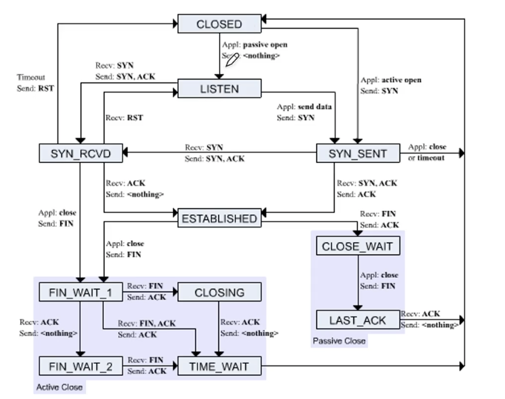

## **Ch 1. 오리엔테이션**

### **01. 네트워크 거시적으로 보기**

#### **컴퓨터 네트워크**
- 여러 장치들이 서로 정보를 주고받을 수 있는 통신망

#### **구성요소**
- 노드, 메세지, 간선(네트워크)

#### **노드**
- 종단 시스템, **호스트**

- **메세지를 최초로 송신, 생성하는 대상**

- 주소를 통해 위치를 특정
    + 유니캐스트 - 1:1
        + 개별 호스트에게 데이터를 전송하는 방식
        + 예시: 개인 메시지, 웹 브라우징
        
    + 브로드캐스트 - 1:n (공지사항)
        + 네트워크 상의 모든 호스트에게 데이터를 전송하는 방식
        + 예시: 비상 상황 발생 시 경보 시스템

    + 멀티캐스트 - 1:특정그룹 
        + 선택된 그룹에게 데이터를 전송하는 방식
        + 예시: 온라인 비디오 스트리밍

#### **서버와 클라이언트**
- 클라이언트 : 요청을 보내는 호스트

- 서버 : 응답을 받는 호스트

- 예시: url을 치는 사람 : 클라이언트, 응답을 보내주는 웹서버 : 서버

- 서버와 클라이언트는 배타적인 개념은 아니다

#### **(중간)노드**
- 네트워크 장비

- 라우터, 스위치, 공유기

- 호스트와 배타적인 개념은 아니다

#### **간선(통신 링크)**
- 유선 케이블(트위스트 페어 케이블, 광케이블)

- 무선(와이파이)

#### **메세지**
- 주고받는 정보

- 웹 페이지, 사진, 동영상 ...

>#### **LAN(Local Area Network)**
>- 근거리를 연결한 네트워크

>#### **WAN(Wide Area Network)**
>- 원거리를 연결한 네트워크(인터넷)
>
>- ISP(KT, SK 브로드밴드, LG U+)에 의해 구축

### **02. 프로토콜과 캡슐화**

#### **패킷 교환 네트워크**
- 주고받는 정보를 패킷(packet) 단위로 주고받는 네트워크

- 패킷이란 패킷 교환 네트워크에서 주고받는 데이터 단위

#### 회선 교환 네트워크
- 패킷 교환 네트워크와 비교되는 네트워크

- 정해진 회선(circuit)으로만 통신하는 네트워크

- 사전에 연결 수립 작업

- 다른 호스트는 도중에 끼어들 수 없음(전통적 전화망)

- 장점: 전송률 보장

- 단점: 회선 이용률 저하(a가 b에게 보내고 있을때 c가 b에게 보낼 수 없다)

>#### **패킷 구성 요소**
>- 헤더: 패킷에 붙일 부가 정보(주소, 프로토콜을 구현기하기 위한 정보)
>
>- 페이로드: 패킷에 보낼 정보
- [트레일러]: 패킷 뒤에 붙일 부가정보

>#### **프로토콜**
>- 장비 간 정보를 주고받을 규칙이나 방법
>
>- 호스트 간에 합의된 의사소통 규칙 (노드간의 언어)
>
>- 헤더의 내용은 프로토콜의 영향을 받는다
>
>- 프로토콜이 달라지면 헤더의 내용이 달라질 수 있다.

#### **OSI 모델 vs TCP/IP**

##### **OSI 모델(이론)**
- 물리 계층
    + 근원적인 송수신이 이루어지는 계층

- 데이터링크 계층
    + 오류제어, LAN환경에서 주소식별(MAC주소), 충돌방지 

- 네트워크 계층
    + 네트워크 간의 통신

- 전송 계층
    + 컴퓨터의 프로그램이 인터넷 밖으로 나갈때 어떻게 식별될지에 대한 정보(port)

- 세션 계층
    + 세션이라는 연결관계를 유지하고 수립

- 표현 계층
    + 압축, 인코딩

- 응용 계층
    + 어플리케이션이 동작(HTTP)

##### **TCP/IP 모델(구현)**
- 네트워크 엑세스 계층
    + (OSI 모델) 데이터 링크 계층 + 물리계층과 유사

- 인터넷 계층
    + (OSI 모델) 네트워크 계층과 유사
    
    + IP 프로토콜

- 전송 계층
    + (OSI 모델) 전송 계층과 유사

    + TCP 프로토콜

- 응용 계층
    + (OSI 모델) 운용계층 + 표현계층 + 세션계층과 유사

    + HTTP 프로토콜

#### **캡슐화**
- 계층을 지나면 헤더가 추가됨
- 상위 계층으로부터 내려받은 패킷을 페이로드로 삼아, 상위 계층오로부터 받은 정보에 프로토콜에 걸맞는 헤더(혹은 트레일러) 를 덧붙이는 것

#### **역캡슐화**
- 캡슐화 과정에서 붙인 헤더 및 트레일러를 각 계층에서 제거하는 것(받는사람)

>#### **캡슐화와 역캡슐화**
>- 응용계층 ~ 세션계층에서의 PDU는 데이터(data)
>
>- 전송계층의 PDU는 TCP 이용시에는 세그먼트(segment), UDP 이용시에는 데이터그램(datagram)
>
>- 네트워크 계층의 PDU는 IP패킷(IP packet)
>
>- 데이터 링크 계층의 PDU는 프레임(frame)
>
>- 물리계층의 PDU는 비트(bit)

### **03. 네트워크의 성능**

#### **트래픽**
- 특정 시간 동안 네트워크 내 정보 흐름

- 얼마나 많은 패킷이 한 순간 몰리는가
    + "트래픽이 몰린다" > 과부화 > 오버해드
    + "태래픽을 분산한다"

#### **전송 속도**
- bps(b/s, bits per second)

- Mbps(Mb/s, Megagits per second)

- Gbps(Gb/s, Gigabits per second)

- 단위 시간 동안 네트워크를 통해 전송되는 테이터 양

#### **처리율(Throughput)**
- 단위 시간 동안 네트워크를 통해 전송되는 데이터 양

#### 대역폭(Bandwidth)
- 네트워크 트래픽을 수용할 수 있는 용량

- 송수신 가능한 최대 데이터 양

- "전송 매체의 두께"

#### 패킷 손실 (packet loss)
- 얼마나 많은 패킷이 송수신 과정에서 손실되었는가

- 보통 백분율로 표기

## **Ch 2. 네트워크 엑세스 계층**

### **01. 이더넷**

#### **이더넷이란**
"물리계층에서 본 이더넷"
- WAN > 인터넷

- LAN > 이더넷

- 현대 (유선) LAN에서 가장 대중적으로 사용되는 기술

- 물리 계층, 데이터 링크 계층 (네트워크 엑세스 계층) 스펙/프로토콜 정의

- 이더넷 표준 규격 버전 : 802.3 뒤 알파벳으로 표기
    
    - 이더넷 표준 규격이 달라지면 케이블, 전송 속도 등이 달라질 수 있다.

    - 이더넷 케이블을 지칭할 때 : 전속속도 BASE - 추가특성(10BASE-T, 25GBASE-LR)

        - 추가특성
            - C : 동축 케이블

            - T : 트위스티드 페어 케이블

            - S : 멀티 모드 광케이블

            - L : 싱글 모드 광케이블

    - "8:00 에 속도가 이상함 강사님 말이 맞는건지"

#### **이더넷 기술**
- 물리 계층 : 이더넷으로 통신이 가능한 케이블

- 데이터 링크 : 이더넷 프레임

- 'https://www.ieee802.org/3/' 이더넷 규격으로 통신하기위한 표준들을 만듦

"데이터 링크 계층에서 본 이더넷"
#### 이더넷 프레임 
- 이더넷 네트워크에서 주고받는 데이터 형싱

- 프리엠블 
    -  이더넷 프레임의 시작을 알리는 비트열, 송수신간의 동기화 첫 7바이트는 10101010, 마지막 1바이트는 10101011(SFD)

>- **목적지/ 송신지 MAC 주소**
>    - 물리적 주소, 네트워크 장지(NIC)마다 할당된 고유한 주소 네트워크 세상의 주민번호
>
>    - NIC(네트워크 인터페이스)
>
>        + 연결 매체를 통해 받은 신호를 컴퓨터에게 전달
>
>        + 네트워크에 연결하기 위한 하드웨어
>
>        + 프레임을 판단 폐기

- 이더타입/길이
    - 1536 이상일 경우 : 이더타입
    
    - 1500 이하일 경우 : 프레임 크기

- 페이로드
    - 운반할 데이터

- FCS
    - 오류 검출을 위한 CRC 값이 명시되는 필드
    - 송수신 host가 2개 연결되어있을 때 수신지에서 CRC값을 계산 비교 후 수신 or 폐기

### **02. 허브와 CSMA/CD**

#### 허브(hub)
- 물리계층의 장비

- MAC 주소를 사용하지 않는다 (MAC주소는 데이터 링크 계층 개념)

- 호스트를 연결할 수 있는 포트 (port)

- 주소 개념이 없기 때문에 모든 포트로 정보를 내보냄

- 최근에는 잘 사용하지 않음

>- **반이중 통신(half-duplex)**
>    - 송신 혹은 수진이 한 번에 한 번만 이루어지는 통신 (e.g. 무전기)
>    
>    - 동시에 허브로 데이터를 전송한 경우 충돌이 발생(범위:콜리전 도메인)
>        - 허브일 경우 port에 연결된 모든 host

>- **전이중 통신(full-duplex)**
>    - 송신과 수신이 동시에 이루어지는 통신(e.g. 전화)

>##### **반이중 이더넷의 충돌을 해결하기 위한 CSMA/CD**
>1. CS: Carrier Sense
>    - 캐리어(반송파) 감지 : 메세지 전송 전 현재 전송중인 것이 있는지 확인
>
>2. MA: Multiple Access
>    - 다중 접근 : 두 개 이상의 호스트가 동시에 네트워크에 접근(충돌 발생)
>
>3. CD: Collision Detection
>    - 충돌 감지 : 잼 신호(jam sigmal)를 보낸 뒤 임의의 시간 동안 대기 후 재전송

##### **허브의 특성**
- 전달 받은 신호를 모든 포트로 내보냄

- 연결된 모든 호스트가 충돌 도메인

- 반이중 모드로 통신

### **03. 스위치와 VLAN**

#### **스위치**

- 전달 받은 신호를 목적지 포트로만 내보내고 목적지 호스트가 연결된 곳만 충돌 도메인에 속해 있으며 전이중 모드로 통신하는 '데이터 링크 계층의 장비'(MAC주소)

>#### **MAC 주소 학습 기능**
>- 포트에 연결된 호스트와 MAC 주소의 관계를 기억하는 스위치 기능
>
>- MAC 주소 테이블
>
>- 송신지 MAC주소를 기반으로 학습
>
>##### **MAC 주소 학습 과정**
>
>1. 플러딩
>    - 허브와 같이 모든 포트에 프레임 전송
>
>2. 포워딩과 필터링
>    - 어떤 포트로 내보내지 않을지 결정
>
>3. 에이징
>    - 특정시간이 지나면 MAC주소 테이블 항목 삭제

"에이징의 특정시간이 지나지 않았을 때 포트에 다른 호스트를 연결한다면 데이터를 줄 수 없나 ?"

#### **VLAN이란(Virtual LAN)**
- 스위치 기능

- 가상의 LAN

>- **브로드캐스트 도메인을 나누기 위함**
>    - 다른부서랑 스위치가 물려있으면 브로드캐스트로 공지를 내릴때 다른부서까지 공지가 간다 그래서 VLAN을 나누어 사용
>    - 다른부서랑 연결을 하고 싶을 때 네트워크 계층 이상의 장비를 필요로함(라우터)

#### **VLAN의 종류**
- 포트 기반의 VLAN 
    - 특정 포트를 기반으로 나눔
    
- MAC주소 기반 VLAN(동적 VLAN)
    - 특정 MAC주소를 따라 VLAN 구분

## **Ch 3. 네트워크 계층**
- 네트워크 간의 통신이 가능하게 하는 계층
### **01. IP**

#### **네트워크 계층**
- 물리 계층과 데이터링크 계층 > LAN에 국한된 통신

- LAN을 넘기 위한 계층

- 네트워크 간 통신이 가능한 계층 > 라우팅
    
    - 라우팅 : 패킷을 목적지까지 최적의 경로로 찾아가는 과정
    
    - 라우터 : 라우팅을 가능하게 하는 장비

- 단편화가 이루어지는 계층

    - 단편화 : 패킷으로 쪼개는 과정 

    - IP 프로토콜을 이용해서 단편화

##### **데이터링크 계층의 MAC 주소가 있는데 왜 IP?**
>- 도달 경로를 파악하기 어려움(라우팅 어려움)
>
>    - 데이터를 보내기 위해서는 제대로 된 주소가 필요로 하다
>
>    - 같은 LAN에서도 MAC주소 만으로 통신이 가능하지만 기본적으로 IP주소가 먼저 활용된다

- 임의의 네트워크에 속한 호스트의 MAC 주소를 기억하기 어려움

>- MAC주소
>
>    - MAC주소 = 물리주소(주민번호) (변경불가능) 
>
>    - NIC를 제작할때 고유할당
>
>- IP주소
>
>    - IP주소는 논리주소 (거주지) (변경가능)
>
>    - 직접 할당
>    
>    - 자동 할당(DHCP)

#### **IP의 두가지 주요 기능**
- IP 주소 지정

- 단편화

- [IP공식문서](https://datatracker.ietf.org/doc/html/rfc791)

>#### **단편화**
>- 패킷의 크기를 MTU(Maximum Transmission Unit) 이하로 유지
>
>- MTU 크기 이하로 단편화된 패킷들은 목적지에서 재조합

#### **IPv4 헤더**
- 송신지, 목적지 IP주소

>- 식별자, 플래그, 단편화
>    - 단편화에서 주로 사용되는 헤더 3가지
>
>    - 식별자 : 패킷에 할당된 번호 (재조합 시 사용)
>
>    - 플래그 : 부가 정보 (미사용, Don't Fragment, More Fragment 비트)
>
>    - 단편화 오프셋 : 단편화되기 전 데이터가 첫번째 패킷으로부터 얼마나 떨어져 패킷인가의 정보

- TTL, 프로토콜
    - TTL(Time To Live) : 패킷의 수명, 라우터를 거칠 때마다 1감소
        + 무한 순환이 생길수 있어서 필요로 함
    - 프로토콜 : 상위 계층의 프로토콜 (e.g. TCP==6, UDP==17)

#### **IPv4 주소**

- 4바이트 (32비트)로 표현 가능

- 한 옥텟은 0~255 범위의 네 개의 십진수로 표기

- 이론적으로 할당 가능한 IPv4 주소 개수 == 2^32개

- IP 주소 부족 문제

- 아직 고갈되지 않았음

#### **IPv6 주소**
- 16바이트 (128비트)로 표현 가능

- 이론적으로 할당 가능한 IPv6주소 개수 == 2^128개

- 의외로 헤더가 더 단순하다.

### **02.ARP**
- IP 주소를 통해 MAC 주소를 알아내기 위한 프로토콜

- **동일 네트워크 내의** 호스트의 MAC주소를 알아내기 위한 프로토콜

#### **ARP 동작 과정**
1. ARP 요청

2. ARP 응답

3. ARP 테이블(ARP캐시) 갱신

##### **1. ARP 요청 (브로드캐스트 메세지)**
- 특정 IP주소를 가진 호스트의 MAC 주소를 알아내기 위해 보내는 브로드캐스트 메세지

- 해당 호스트의 MAC 주소를 모르기 때문에 브로드캐스트 메세지로 전송

##### **2. ARP 응답**
- ARP 요청 메세지에 대한 응답. 자신의 MAC 주소 포함

##### **3. ARP 테이블 갱신**
- ARP 테이블(ARP캐시): MAC 주소와 IP 주소가 매핑된 표 형태의 데이터

- 일정 시간이 지나면 삭제

- ARP테이블에 추가된 호스트는 브로드캐스트로 ARP 요청을 보낼 필요 없음(트래픽 증가를 막기위해)

##### **다른 네트워크에 속한 호스트의 MAC 주소 알아내기**
1. 라우터의 mac주소를 1차적으로 알아냄

2. 다른 라우터의 mac주소를 알아내서 연결된 호스트의 mac주소를 알아냄

- 라우팅 프로토콜, arp 등 여러가지가 필요

### **03.ICMP**

#### **IP프로토콜의 한계**
1. 비신뢰성
    - 패킷이 목적지까지 제대로 전송한다는 보장이 없는 특성

    - 최선형 전달(best-effort delivery)

    - 신뢰성 프로토콜, 연결형 프로토콜을 제공하는 계층은 전송 계층(TCP)
2. 비연결형
    - 호스트 간의 사전 연결 수립이 없는 특성

#### ICMP
- IP의 비신뢰성과 비연결형 특성을 보완하기 위한 네트워크 계층 프로토콜

- IP 패킷의 전송 과정에 대한 피트백 메세지 제공
    
    - 오류보고

    - 네트워크 진단 정보

- $traceroute [url] url 호스트에 도달하기 위한 전체 경로 출력

- IP의 한계를 보완할 뿐 완전히 해결하는 것은 아니다.

- 근본적인 해결은 전송 계층에서 이루어짐

[ICMP공식문서](https://www.rfc-editor.org/rfc/rfc792)

### **04.IP 주소**

- IP 주소의 구성
    - 네트워크 주소, 호스트 주소(**유동적**)

- MAC주소의 구성
    - 제조사 번호, 일련번호 (24/24비트 고정)

##### **클래스풀 주소체계**
- 정해져 있는 클래스(크기)에 맞게 호스트 IP 할당

##### **클래스리스 주소체계**
- 클래스풀 주소 체계보다 더 정교히 네트워크를 나누는 방법

- 오늘날 주로 사용하는 방식

- 네트워크와 호스트를 구분하기 위해 **서브넷 마스크** 이용

    - 서브넷 마스크
        + IP주소 상에서 네트워크 주소는 1, 호스트 주소는 0으로 이루어진 비트열

        + 클래스 A : 255.0.0.0

        + 클래스 B : 255.255.0.0

        + 클래스 C : 255.255.255.0

- 서브넷 마스크와 IP 주소의 비트 AND연산 > 네트워크 주소 (둘다 1일때 1)

##### **CIDR 표기**
- 서브넷 마스크 상의 1의 개수를 IP주소/숫자로 표기

- 192.168.100.103/**30**

- '''네트워크 주소를 빼는 이유가 뭐지?'''

### **06.IP주소의 분류**

#### **공인IP 주소와 사설 IP 주소**
- 공인 IP 주소 : 인터넷 사용할 때 사용하는 고유한 주소

- 사설 IP 주소 : 사설 네트워크 내에서 사용하는 고유하지 않은 주소
    
    - 사설 IP 주소 대역
        + 10.0.0.0/8

        + 172.16.0.0/12

        + 192.16.0.0/16

#### **NAT**
- 공인 IP 주소와 사설 IP 주소 간의 변환 기능
        
    - 하나의 공인 IP 주소를 여러 사설 IP 주소가 공유 가능

    - IP 주소 부족 문제 해결

##### **정적 IP 주소와 동적 IP 주소**
- IP 주소의 할당 방법 : 정적 할당과 동적 할당

- 정적 IP 주소 : 정적 할당된 IP 주소 (고정)

- 동적 IP 주소 : 동적 할당된 IP 주소 (유동적)

#### **DHCP**

- 동적 IP 주소를 할당하기 위한 프로토콜

- DHCP 서버에 의해 동적으로 IP 주소 할당 (==IP 주소 임대)

- 정해진 임대 시간이 끝날 경우 임대 갱신 (자동 수행, 수동 수행)

### **07.라우팅**

#### **라우터**
- LAN에서 외부로 나가기 위한 최초 라우터 = **Default gateway**
    "다음 라우터는 공인IP인지?"

- 라우팅 : 피킷이 이동할 최적 경로 설정, 해당 경로로 패킷 이동

- 라우팅 피로토콜 : 라우팅을 수행하는 방법

- 홉 : 라우터와 라우터 간의 패킷 이동 과정

- 홉 바이 홉 라우팅

#### **라우팅 테이블**

- 특정 목적지까지 도달하기 위한 정보를 명시하는 표와 같은 정보

- 대표적인 정보 : 목적지 주소, 서브넷 마스크, 게이트웨이, 인터페이스, 메트릭(비용)

- 롱기스트 프리픽스 매치
    - 여러 라우팅 테이블 항목과 일치할 경우 가장 길게 일치하는 항목 선택 후 패킷 전송

- 디폴트 라우트
    - 합치되는 경로가 없을 경우 기본으로 내보낼 경로

- 라우팅 테이블
    - $route -v
    - $netstat -rn

- 만들어지는 과정
    - 정적 라우팅 : 수동으로 라우팅 테이블 항목 채워넣기
        - 중간 라우터에 문제가 생길때 패킷이 도달하지 않음

    - 동적 라우팅 : 자동으로 라우팅 테이블 항목 채워넣기 (라우팅 프로토콜)
        - 경로 우회 가능

#### **라우팅 프로토콜**
- AS 내부 라우팅 프로토콜(IGP) : RIP(거리 백터 활용), OSPF(링크 상태 활용)

- AS 외부 라우팅 프로토콜(EGP) : BGP

- AS == 동일한 라우팅 정책으로 운영되는 라우터들의 집단 네트워크

## **Ch 4. 전송계층**

###  **01.포트**

#### **전송 계층의 역할**
- 응용 계층의 어플리케이션 프로세스 식별 = 포트

- 네트워크 계층의 신뢰선/연결성 확립 (한계 극복)

#### **포트**

- 포트 번호는 16피트로 표현 가능 (65536개)

- 포트 범위 : 0번부터 65535번까지

- 포트의 종류

    - 잘 알려진 포트, 웰 노운 포트, 시스템포트
        - FTP :20,21 > 파일을 전송하기 위한 프로토콜

        - SSH : 22 > 안전하게 정보를 주고 받기 위한 프로토콜

        - SMTP : 25 > E-mail을 주고 받기 위한 프로토콜

        - DNS : 53 > 도메인 네임 서버

        - HTTP : 80 > 웹 페이지를 전송하기 위한 프로토콜

        - HTTPS : 443 > 안전한 웹 페이지 전송을 위한 프로토콜

    - 등록된 포트

    - 동적 포트, 사설 포트, 임시 포트
        - 사용자가 자유롭게 할당 가능한 포트

    - 서버 -> 일반적으로 잘 알려진 포트와 등록된 포트로 동작

    - 클라이언트 -> 일반적으로 동적 포트로 동작
    
##### **NAT 공인 IP 주소와 사설 IP 주소 간의 변환 기능**
- 하나의 공인 IP 주소를 여러 사설 IP 주소가 공유 가능

- IP 주소 부족 문제 해결

###  **03.TCP와 UDP**
- MSS : TCP 세그먼트로 보낼 수 있는 최대 크기(페이로드)

#### TCP 세그먼트 구조
- 출발지 포트

- 목적지 포트

- **순서 번호(sequence number)**
    + 올바름 순서로 데이터를 보내기 위해 누락되는 세그먼트가 없도록 데이터에 번호를 붙임

- **확인 응답 번호**
    + 선서 번호에 대한 응답(다음으로 수신받길 기대하는 바이트 번호)

- 제어 비트
    + ACK : 세그먼트 승인을 나타내는 비트

    + SYN : 연결 수립을 위한 비트 

    + FIN : 연결을 끝내기 위한 비트

    + RST : 연결을 리셋하기 위한 비트

- 윈도우
    + 수신지 윈도우 크기. 한 번에 수신 받고자 하는 양

- UDP는 IP 패킷을 감싸는 껍데기일 뿐
    - 비연결성/비신뢰성 프로토콜

    - TCP의 재전송/흐름 제어/ 혼잡 제어 등의 기능이 없음

###  **05.TCP 연결**

#### **TCP 연결형 프로토콜**
1. 연결 설정 > **Three way handshake**
    - SYN(연결) > SYN,ACK(연결,승인) > ACK(승인)

2. 데이터 송수신 

3. 연결 종료
    - FIN > ACK , FIN > ACK

- 엑티브클로즈 호스트는 마지막 ACK를 보낸 뒤 어느정도 시간이 지난 뒤 종료
    - 마지막 ACK 세그먼트 유실 대비

    - 또 다른 연결 과정에서의 패킷 혼선 방지

###  **06.TCP 상태**

- TCP는 연결형 프로토콜 + 스테이트풀(상태) 프로토콜
    - 현재 연결 상태를 나타내기 위해 다양한 상태(state) 활용

- TCP 상태

    - CLOSED: 연결이 초기화되지 않았거나 연결이 종료된 상태

    - LISTEN: 서버가 클라이언트의 연결 요청을 기다리는 상태

    - SYN_SENT: 클라이언트가 서버에게 연결을 요청한 후 SYN 세그먼트를 보낸 후 SYN+ACK 세그먼트를 기다리는 상태

    - SYN_RECEIVED: 서버가 클라이언트의 연결 요청에 대한 응답으로 SYN-ACK 세그먼트를 보낸 후 ACK세그먼트를 기다리는 상태

    - ESTABLISHED: 연결이 설정되고 데이터 전송이 이루어지는 상태

    - FIN_WAIT_1: 연결을 종료하고자 하는 측에서 FIN 세그먼트를 보낸 후 상대방의 응답을 기다리는 상태

    - FIN_WAIT_2: 상대방이 FIN 세그먼트에 응답하고 연결을 종료할 준비가 되었지만, 아직 연결이 종료되지 않은 상태

    - CLOSE_WAIT: 상대방이 FIN 세그먼트를 보낸 후, 이를 받은 측에서 연결을 종료하기 위한 준비를 하고 있는 상태

    - CLOSING: 양쪽 모두에서 연결 종료를 위해 FIN 세그먼트를 보낸 후, 서로의 응답을 기다리는 상태

    - LAST_ACK: 연결 종료를 위해 FIN 세그먼트를 보낸 측이 상대방의 확인 응답을 기다리는 상태

    - TIME_WAIT: 연결이 종료된 후 일정 시간 동안 대기하는 상태로, 이전 연결의 모든 세그먼트이 완전히 소멸하기를 기다리는 상태

    - CLOSED: 연결이 완전히 종료되어 소켓이 닫힌 상태

    - CLOSING: 상대 FIN 세그먼트에 ACK 세그먼트를 보냈지만 자신의 FIN 세그먼트에 대한 ACK 세그먼트를 받지 못한 상태 (보통 동시에 연결을 종료하려 할 때)

###  **07.TCP 재전송 기능**

#### TCP는 신뢰성 프로토콜
- 무엇인가를 확실히 전송했다는 보장이 있으려면
    
    - **재전송 기반의 오류 제어 : 잘못 전송된 경우 재전송**

    - 흐름 제어 : 받을 수 있을 만큼만 받기

    - 혼잡 제어 : 보낼 수 있는 상황에서만 보내기

- 언제 잘못 되었음을 인지할까?
    
    1. 중복된 ACK 세그먼트를 수신했을 때

    2. 타임아웃이 발생했을 때

- TCP 오류 제어

    - TCP는 재전송 기반의 오류 제어를 수행

    - 재전송을 기반으로 잘못된 전송을 바로잡는 것 : ARQ(자동 재전송 요구)

        - Stop and Wait ARQ

            - 가장 단순한 형태

            - 제대로 보냈음을 확인하기 전까지는 보내지 않음

            - 전송하고, 확인하고, 전송하고, 확인하고

            - 네트워크 이용 효율이 낮아지는 문제

            - 해결하기 위해 여러 세그먼트를 한 번에 전송 == 파이프라이닝

        - Go Back N ARQ 

            - 올바른 세그먼트에 대해서는 확인응답을 보냄

            - 올바르지 않은 세그먼트가 수신되면 n+1 이후 전부 폐기 > 타임아웃 > 재전송

            - 누적 확인 응답 (Cumulative ACK)

            - "마지막 세그먼트의 번호를 수신자가 어떻게 알고 있는건지?"

        - Selective Repeat ARQ

            - 올바른 세그먼트를 개별적으로 확인응답을 보냄

    - 빠른 재전송

        - 빠른 재전송이 없는 경우 : 재전송 타이머가 만료되면 재전송

        - 재전송 타이머가 만료되지 않아도 중복 세그먼트가 수신되면 재전송

###  **07.TCP의 혼잡 제어와 흐름 제어**

#### TCP는 신뢰성 프로토콜
- 무엇인가를 확실히 전송했다는 보장이 있으려면
    
    - 재전송 기반의 오류 제어 : 잘못 전송된 경우 재전송

    - **흐름 제어 : 받을 수 있을 만큼만 받기**

    - **혼잡 제어 : 보낼 수 있는 상황에서만 보내기**

#### **TCP 흐름 제어**

- 파이프라이닝 전송을 할때 송수신할 수 있는 양의 한계가 있다(버퍼의 크기)
    
    - 송신 버퍼 : 어플리케이션 계층에서 전송할 데이터 임시 저장

    - 수신 버퍼 : 네트워크 계층에서 수신할 데이터 임시 저장

- 송신 호스트가 수신 호스트가 처리할 수 있는 수신 버퍼보다 더 많은 데이터를 전송하면
    
    - 버퍼 오버플로우 발생 > 일부 데이터가 처리되지 않을 수 있음

- 송신 호스트가 수신 호스트 처리 속도를 고려하며 송수신 속도를 균일하게 맞추는 것
    
    - 오늘날 TCP에서의 흐름 제어 > 슬라이딩 윈도우

    - TCP 헤더를 통해 수신 Window 크기를 송신지에게 보내줌

- 윈도우 : 파이프 라이닝 가능한 순서번호 범위

- 윈도우 크기 : 확인 응답 받지 않고도 한번에 보낼 수 있는 최대 양

- 흐름제어의 주체는 '수신지'

- 수신 호스트
    - 수신 윈도우 = 수신 버퍼 크기 - [마지막 수신 바이트 - 마지막 읽은 바이트]

- 송신 호스트
    - 수신 윈도우 >= 마지막 송신 바이트 - 마지막 수신 확인된 바이트

#### **TCP 혼잡 제어**

- 혼잡(congestion)

- 많은 트래픽으로 인해 패킷 처리 속도가 느려지거나 유실될 우려가 있는 상황

- 혼잡 > 유실 > 재전송 > 혼잡 > 유실 > 재전송 > ... (혼잡붕괴현상)

- 혼잡이 생기지 않을 정도로만 조금씩 전송하는 방법 

- 혼잡 제어의 주체는 '송신지'

- 혼잡 윈도우 : 혼잡 없이 전송할 수 있을 법한 양

- 송신 호스트

    - 최소값(수신 윈도우, 혼잡 윈도우) >= 마지막으로 송신한 바이트 - 마지막으로 수신 확인된 바이트

- 기본 동작 형태 : AIMD (Additive Increase Multicative Decrease)

##### **혼잡 제어 알고리즘**

- 혼잡 제어를 수행하는 알고리즘

- 배경지식 : RTT(Round Trip Time)

    - 메세지를 전송한 뒤 그에 대한 답변을 받는 시간

1. 느린 시작

    - ACK 세그먼트가 수신될 때마다 혼잡 윈도우가 1증가 (RTT마다 혼잡 윈도우 2배 증가)

    - **특정 임계치(ssthresh) 값과 같아지면 혼잡 회피 수행**

    - 세 번의 중복 세그먼트가 발생했을 경우 빠른 회복 수행

2. 혼잡 회피

    - 매 RTT마다 혼잡 윈도우 1씩 증가(선형적)

    - 세 번의 중복 세그먼트가 발생했을 경우 빠른 회복 수행

3. 빠른 회복

    - 세 번의 중복 ACK 세그먼트가 수신되었을 때 느린 시작을 건너뛰고 혼잡 회피를 수행하는 알고리즘 TCP Tahoe(빠른 회복 미수행) vs TCP Reno(빠른 회복 수행(절반정도로 떨어트리고 수행))

