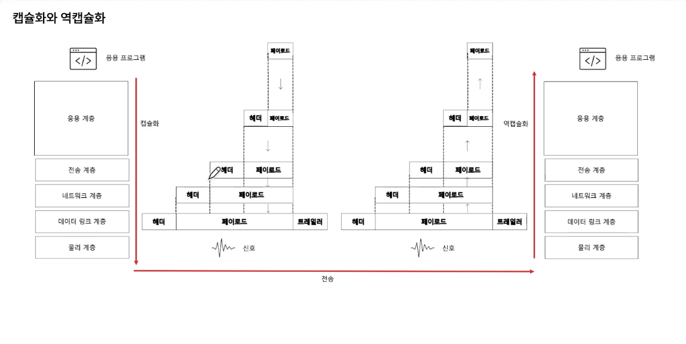

## ***Ch 1. 오리엔테이션**

### **01. 네트워크 거시적으로 보기**

#### **컴퓨터 네트워크**
- 여러 장치들이 서로 정보를 주고받을 수 있는 통신망

#### **구성요소**
- 노드, 메세지, 간선(네트워크)

#### **노드**
- 종단 시스템, **호스트**

- **메세지를 최초로 송신, 생성하는 대상**

- 주소를 통해 위치를 특정
    + 유니캐스트 - 1:1
        + 개별 호스트에게 데이터를 전송하는 방식
        + 예시: 개인 메시지, 웹 브라우징
        
    + 브로드캐스트 - 1:n (공지사항)
        + 네트워크 상의 모든 호스트에게 데이터를 전송하는 방식
        + 예시: 비상 상황 발생 시 경보 시스템

    + 멀티캐스트 - 1:특정그룹 
        + 선택된 그룹에게 데이터를 전송하는 방식
        + 예시: 온라인 비디오 스트리밍

#### **서버와 클라이언트**
- 클라이언트 : 요청을 보내는 호스트

- 서버 : 응답을 받는 호스트

- 예시: url을 치는 사람 : 클라이언트, 응답을 보내주는 웹서버 : 서버

- 서버와 클라이언트는 배타적인 개념은 아니다

#### **(중간)노드**
- 네트워크 장비

- 라우터, 스위치, 공유기

- 호스트와 배타적인 개념은 아니다

#### **간선(통신 링크)**
- 유선 케이블(트위스트 페어 케이블, 광케이블)

- 무선(와이파이)

#### **메세지**
- 주고받는 정보

- 웹 페이지, 사진, 동영상 ...

>#### **LAN(Local Area Network)**
>- 근거리를 연결한 네트워크

>#### **WAN(Wide Area Network)**
>- 원거리를 연결한 네트워크(인터넷)
>
>- ISP(KT, SK 브로드밴드, LG U+)에 의해 구축

### **02. 프로토콜과 캡슐화**

#### **패킷 교환 네트워크**
- 주고받는 정보를 패킷(packet) 단위로 주고받는 네트워크

- 패킷이란 패킷 교환 네트워크에서 주고받는 데이터 단위

#### 회선 교환 네트워크
- 패킷 교환 네트워크와 비교되는 네트워크

- 정해진 회선(circuit)으로만 통신하는 네트워크

- 사전에 연결 수립 작업

- 다른 호스트는 도중에 끼어들 수 없음(전통적 전화망)

- 장점: 전송률 보장

- 단점: 회선 이용률 저하(a가 b에게 보내고 있을때 c가 b에게 보낼 수 없다)

>#### **패킷 구성 요소**
>- 헤더: 패킷에 붙일 부가 정보(주소, 프로토콜을 구현기하기 위한 정보)
>
>- 페이로드: 패킷에 보낼 정보
- [트레일러]: 패킷 뒤에 붙일 부가정보

>#### **프로토콜**
>- 장비 간 정보를 주고받을 규칙이나 방법
>
>- 호스트 간에 합의된 의사소통 규칙 (노드간의 언어)
>
>- 헤더의 내용은 프로토콜의 영향을 받는다
>
>- 프로토콜이 달라지면 헤더의 내용이 달라질 수 있다.

#### **OSI 모델 vs TCP/IP**

##### **OSI 모델(이론)**
- 물리 계층
    + 근원적인 송수신이 이루어지는 계층

- 데이터링크 계층
    + 오류제어, LAN환경에서 주소식별(MAC주소), 충돌방지 

- 네트워크 계층
    + 네트워크 간의 통신

- 전송 계층
    + 컴퓨터의 프로그램이 인터넷 밖으로 나갈때 어떻게 식별될지에 대한 정보(port)

- 세션 계층
    + 세션이라는 연결관계를 유지하고 수립

- 표현 계층
    + 압축, 인코딩

- 응용 계층
    + 어플리케이션이 동작(HTTP)

##### **TCP/IP 모델(구현)**
- 네트워크 엑세스 계층
    + (OSI 모델) 데이터 링크 계층 + 물리계층과 유사

- 인터넷 계층
    + (OSI 모델) 네트워크 계층과 유사
    
    + IP 프로토콜

- 전송 계층
    + (OSI 모델) 전송 계층과 유사

    + TCP 프로토콜

- 응용 계층
    + (OSI 모델) 운용계층 + 표현계층 + 세션계층과 유사

    + HTTP 프로토콜

#### **캡슐화**
- 계층을 지나면 헤더가 추가됨
- 상위 계층으로부터 내려받은 패킷을 페이로드로 삼아, 상위 계층오로부터 받은 정보에 프로토콜에 걸맞는 헤더(혹은 트레일러) 를 덧붙이는 것

#### **역캡슐화**
- 캡슐화 과정에서 붙인 헤더 및 트레일러를 각 계층에서 제거하는 것(받는사람)

>#### **캡슐화와 역캡슐화**
>- 응용계층 ~ 세션계층에서의 PDU는 데이터(data)
>
>- 전송계층의 PDU는 TCP 이용시에는 세그먼트(segment), UDP 이용시에는 데이터그램(datagram)
>
>- 네트워크 계층의 PDU는 IP패킷(IP packet)
>
>- 데이터 링크 계층의 PDU는 프레임(frame)
>
>- 물리계층의 PDU는 비트(bit)

### **03. 네트워크의 성능**

#### **트래픽**
- 특정 시간 동안 네트워크 내 정보 흐름

- 얼마나 많은 패킷이 한 순간 몰리는가
    + "트래픽이 몰린다" > 과부화 > 오버해드
    + "태래픽을 분산한다"

#### **전송 속도**
- bps(b/s, bits per second)

- Mbps(Mb/s, Megagits per second)

- Gbps(Gb/s, Gigabits per second)

- 단위 시간 동안 네트워크를 통해 전송되는 테이터 양

#### **처리율(Throughput)**
- 단위 시간 동안 네트워크를 통해 전송되는 데이터 양

#### 대역폭(Bandwidth)
- 네트워크 트래픽을 수용할 수 있는 용량

- 송수신 가능한 최대 데이터 양

- "전송 매체의 두께"

#### 패킷 손실 (packet loss)
- 얼마나 많은 패킷이 송수신 과정에서 손실되었는가

- 보통 백분율로 표기

## ***Ch 2. 네트워크 엑세스 계층**

## **01. 이더넷**

### **이더넷이란**
"물리계층에서 본 이더넷"
- WAN > 인터넷

- LAN > 이더넷

- 현대 (유선) LAN에서 가장 대중적으로 사용되는 기술

- 물리 계층, 데이터 링크 계층 (네트워크 엑세스 계층) 스펙/프로토콜 정의

- 이더넷 표준 규격 버전 : 802.3 뒤 알파벳으로 표기
    
    - 이더넷 표준 규격이 달라지면 케이블, 전송 속도 등이 달라질 수 있다.

    - 이더넷 케이블을 지칭할 때 : 전속속도 BASE - 추가특성(10BASE-T, 25GBASE-LR)

        - 추가특성
            - C : 동축 케이블

            - T : 트위스티드 페어 케이블

            - S : 멀티 모드 광케이블

            - L : 싱글 모드 광케이블

    - "8:00 에 속도가 이상함 강사님 말이 맞는건지"

#### **이더넷 기술**
- 물리 계층 : 이더넷으로 통신이 가능한 케이블

- 데이터 링크 : 이더넷 프레임

- 'https://www.ieee802.org/3/' 이더넷 규격으로 통신하기위한 표준들을 만듦

"데이터 링크 계층에서 본 이더넷"
#### 이더넷 프레임 
- 이더넷 네트워크에서 주고받는 데이터 형싱

- 프리엠블 
    -  이더넷 프레임의 시작을 알리는 비트열, 송수신간의 동기화 첫 7바이트는 10101010, 마지막 1바이트는 10101011(SFD)

>- **목적지/ 송신지 MAC 주소**
>    - 물리적 주소, 네트워크 장지(NIC)마다 할당된 고유한 주소 네트워크 세상의 주민번호
>
>    - NIC(네트워크 인터페이스)
>
>        + 연결 매체를 통해 받은 신호를 컴퓨터에게 전달
>
>        + 네트워크에 연결하기 위한 하드웨어
>
>        + 프레임을 판단 폐기

- 이더타입/길이
    - 1536 이상일 경우 : 이더타입
    
    - 1500 이하일 경우 : 프레임 크기

- 페이로드
    - 운반할 데이터

- FCS
    - 오류 검출을 위한 CRC 값이 명시되는 필드
    - 송수신 host가 2개 연결되어있을 때 수신지에서 CRC값을 계산 비교 후 수신 or 폐기

### **02. 허브와 CSMA/CD**

#### 허브(hub)
- 물리계층의 장비

- MAC 주소를 사용하지 않는다 (MAC주소는 데이터 링크 계층 개념)

- 호스트를 연결할 수 있는 포트 (port)

- 주소 개념이 없기 때문에 모든 포트로 정보를 내보냄

- 최근에는 잘 사용하지 않음

>- **반이중 통신(half-duplex)**
>    - 송신 혹은 수진이 한 번에 한 번만 이루어지는 통신 (e.g. 무전기)
>    
>    - 동시에 허브로 데이터를 전송한 경우 충돌이 발생(범위:콜리전 도메인)
>        - 허브일 경우 port에 연결된 모든 host

>- **전이중 통신(full-duplex)**
>    - 송신과 수신이 동시에 이루어지는 통신(e.g. 전화)

>##### **반이중 이더넷의 충돌을 해결하기 위한 CSMA/CD**
>1. CS: Carrier Sense
>    - 캐리어(반송파) 감지 : 메세지 전송 전 현재 전송중인 것이 있는지 확인
>
>2. MA: Multiple Access
>    - 다중 접근 : 두 개 이상의 호스트가 동시에 네트워크에 접근(충돌 발생)
>
>3. CD: Collision Detection
>    - 충돌 감지 : 잼 신호(jam sigmal)를 보낸 뒤 임의의 시간 동안 대기 후 재전송

##### **허브의 특성**
- 전달 받은 신호를 모든 포트로 내보냄

- 연결된 모든 호스트가 충돌 도메인

- 반이중 모드로 통신

## **03. 스위치와 VLAN**

### **스위치**

- 전달 받은 신호를 목적지 포트로만 내보내고 목적지 호스트가 연결된 곳만 충돌 도메인에 속해 있으며 전이중 모드로 통신하는 '데이터 링크 계층의 장비'(MAC주소)

>#### **MAC 주소 학습 기능**
>- 포트에 연결된 호스트와 MAC 주소의 관계를 기억하는 스위치 기능
>
>- MAC 주소 테이블
>
>- 송신지 MAC주소를 기반으로 학습
>
>##### **MAC 주소 학습 과정**
>
>1. 플러딩
>    - 허브와 같이 모든 포트에 프레임 전송
>
>2. 포워딩과 필터링
>    - 어떤 포트로 내보내지 않을지 결정
>
>3. 에이징
>    - 특정시간이 지나면 MAC주소 테이블 항목 삭제

"에이징의 특정시간이 지나지 않았을 때 포트에 다른 호스트를 연결한다면 데이터를 줄 수 없나 ?"

#### **VLAN이란(Virtual LAN)**
- 스위치 기능

- 가상의 LAN

>- **브로드캐스트 도메인을 나누기 위함**
>    - 다른부서랑 스위치가 물려있으면 브로드캐스트로 공지를 내릴때 다른부서까지 공지가 간다 그래서 VLAN을 나누어 사용
>    - 다른부서랑 연결을 하고 싶을 때 네트워크 계층 이상의 장비를 필요로함(라우터)

#### **VLAN의 종류**
- 포트 기반의 VLAN 
    - 특정 포트를 기반으로 나눔
    
- MAC주소 기반 VLAN(동적 VLAN)
    - 특정 MAC주소를 따라 VLAN 구분

## ***Ch 3. 네트워크 계층**
- 네트워크 간의 통시닝 가능하게 하는 계층
### **01. IP**

#### **네트워크 계층**
- 물리 계층과 데이터링크 계층 > LAN에 국한된 통신

- LAN을 넘기 위한 계층

- 네트워크 간 통신이 가능한 계층 > 라우팅
    
    - 라우팅 : 패킷을 목적지까지 최적의 경로로 찾아가는 과정
    
    - 라우터 : 라우팅을 가능하게 하는 장비

- 단편화가 이루어지는 계층

    - 단편화 : 패킷으로 쪼개는 과정 

    - IP 프로토콜을 이용해서 단편화

##### 데이터링크 계층의 MAC 주소가 있는데 왜 IP?
>- 도달 경로를 파악하기 어려움(라우팅 어려움)
>
>    - 데이터를 보내기 위해서는 제대로 된 주소가 필요로 하다
>
>    - 같은 LAN에서도 MAC주소 만으로 통신이 가능하지만 기본적으로 IP주소가 먼저 활용된다

- 임의의 네트워크에 속한 호스트의 MAC 주소를 기억하기 어려움

>- MAC주소
>
>    - MAC주소 = 물리주소(주민번호) (변경불가능) 
>
>    - NIC를 제작할때 고유할당
>
>- IP주소
>
>    - IP주소는 논리주소 (거주지) (변경가능)
>
>    - 직접 할당
>    
>    - 자동 할당(DHCP)

#### IP의 두가지 주요 기능
- IP 주소 지정

- 단편화

- [IP공식문서](https://datatracker.ietf.org/doc/html/rfc791)

#### 단편화
- 패킷의 크기를 MTU(Maximum Transmission Unit) 이하로 유지

- MTU 크기 이하로 단편화된 패킷들은 목적지에서 재조합

#### IPv4 헤더
- 송신지, 목적지 IP주소

- 식별자, 플래그, 단편화
    - 단편화에서 주로 사용되는 헤더 3가지

    - 식별자 : 패킷에 할당된 번호 (재조합 시 사용)

    - 플래그 : 부가 정보 (미사용, Don't Fragment, More Fragment 비트)

    - 단편화 오프셋 : 단편화되기 전 데이터가 첫번째 패킷으로부터 얼마나 떨어져 패킷인가의 정보

- TTL, 프로토콜
    - TTL(Time To Live) : 패킷의 수명, 라우터를 거칠 때마다 1감소
        + 무한 순환이 생길수 있어서 필요로 함
    - 프로토콜 : 상위 계층의 프로토콜 (e.g. TCP==6, UDP==17)

#### IPv4 주소

- 4바이트 (32비트)로 표현 가능

- 한 옥텟은 0~255 범위의 네 개의 십진수로 표기

- 이론적으로 할당 가능한 IPv4 주소 개수 == 2^32개

- IP 주소 부족 문제

- 아직 고갈되지 않았음

#### IPv6 주소
- 16바이트 (128비트)로 표현 가능

- 이론적으로 할당 가능한 IPv6주소 개수 == 2^128개

- 의외로 헤더가 더 단순하다.

