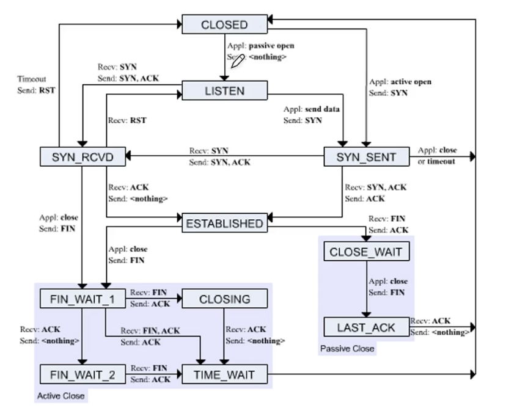

## **Ch 4. 전송계층**

###  **01.포트**

#### **전송 계층의 역할**
- 응용 계층의 어플리케이션 프로세스 식별 = 포트

- 네트워크 계층의 신뢰선/연결성 확립 (한계 극복)

#### **포트**

- 포트 번호는 16피트로 표현 가능 (65536개)

- 포트 범위 : 0번부터 65535번까지

- 포트의 종류

    - 잘 알려진 포트, 웰 노운 포트, 시스템포트
        - FTP :20,21 > 파일을 전송하기 위한 프로토콜

        - SSH : 22 > 안전하게 정보를 주고 받기 위한 프로토콜

        - SMTP : 25 > E-mail을 주고 받기 위한 프로토콜

        - DNS : 53 > 도메인 네임 서버

        - HTTP : 80 > 웹 페이지를 전송하기 위한 프로토콜

        - HTTPS : 443 > 안전한 웹 페이지 전송을 위한 프로토콜

    - 등록된 포트

    - 동적 포트, 사설 포트, 임시 포트
        - 사용자가 자유롭게 할당 가능한 포트

    - 서버 -> 일반적으로 잘 알려진 포트와 등록된 포트로 동작

    - 클라이언트 -> 일반적으로 동적 포트로 동작
    
##### **NAT 공인 IP 주소와 사설 IP 주소 간의 변환 기능**
- 하나의 공인 IP 주소를 여러 사설 IP 주소가 공유 가능

- IP 주소 부족 문제 해결

###  **03.TCP와 UDP**
- MSS : TCP 세그먼트로 보낼 수 있는 최대 크기(페이로드)

#### TCP 세그먼트 구조
- 출발지 포트

- 목적지 포트

- **순서 번호(sequence number)**
    + 올바름 순서로 데이터를 보내기 위해 누락되는 세그먼트가 없도록 데이터에 번호를 붙임

- **확인 응답 번호**
    + 선서 번호에 대한 응답(다음으로 수신받길 기대하는 바이트 번호)

- 제어 비트
    + ACK : 세그먼트 승인을 나타내는 비트

    + SYN : 연결 수립을 위한 비트 

    + FIN : 연결을 끝내기 위한 비트

    + RST : 연결을 리셋하기 위한 비트

- 윈도우
    + 수신지 윈도우 크기. 한 번에 수신 받고자 하는 양

- UDP는 IP 패킷을 감싸는 껍데기일 뿐
    - 비연결성/비신뢰성 프로토콜

    - TCP의 재전송/흐름 제어/ 혼잡 제어 등의 기능이 없음

###  **05.TCP 연결**

#### **TCP 연결형 프로토콜**
1. 연결 설정 > **Three way handshake**
    - SYN(연결) > SYN,ACK(연결,승인) > ACK(승인)

2. 데이터 송수신 

3. 연결 종료
    - FIN > ACK , FIN > ACK

- 엑티브클로즈 호스트는 마지막 ACK를 보낸 뒤 어느정도 시간이 지난 뒤 종료
    - 마지막 ACK 세그먼트 유실 대비

    - 또 다른 연결 과정에서의 패킷 혼선 방지

###  **06.TCP 상태**

- TCP는 연결형 프로토콜 + 스테이트풀(상태) 프로토콜
    - 현재 연결 상태를 나타내기 위해 다양한 상태(state) 활용

- TCP 상태

    - CLOSED: 연결이 초기화되지 않았거나 연결이 종료된 상태

    - LISTEN: 서버가 클라이언트의 연결 요청을 기다리는 상태

    - SYN_SENT: 클라이언트가 서버에게 연결을 요청한 후 SYN 세그먼트를 보낸 후 SYN+ACK 세그먼트를 기다리는 상태

    - SYN_RECEIVED: 서버가 클라이언트의 연결 요청에 대한 응답으로 SYN-ACK 세그먼트를 보낸 후 ACK세그먼트를 기다리는 상태

    - ESTABLISHED: 연결이 설정되고 데이터 전송이 이루어지는 상태

    - FIN_WAIT_1: 연결을 종료하고자 하는 측에서 FIN 세그먼트를 보낸 후 상대방의 응답을 기다리는 상태

    - FIN_WAIT_2: 상대방이 FIN 세그먼트에 응답하고 연결을 종료할 준비가 되었지만, 아직 연결이 종료되지 않은 상태

    - CLOSE_WAIT: 상대방이 FIN 세그먼트를 보낸 후, 이를 받은 측에서 연결을 종료하기 위한 준비를 하고 있는 상태

    - CLOSING: 양쪽 모두에서 연결 종료를 위해 FIN 세그먼트를 보낸 후, 서로의 응답을 기다리는 상태

    - LAST_ACK: 연결 종료를 위해 FIN 세그먼트를 보낸 측이 상대방의 확인 응답을 기다리는 상태

    - TIME_WAIT: 연결이 종료된 후 일정 시간 동안 대기하는 상태로, 이전 연결의 모든 세그먼트이 완전히 소멸하기를 기다리는 상태

    - CLOSED: 연결이 완전히 종료되어 소켓이 닫힌 상태

    - CLOSING: 상대 FIN 세그먼트에 ACK 세그먼트를 보냈지만 자신의 FIN 세그먼트에 대한 ACK 세그먼트를 받지 못한 상태 (보통 동시에 연결을 종료하려 할 때)

###  **07.TCP 재전송 기능**

#### TCP는 신뢰성 프로토콜
- 무엇인가를 확실히 전송했다는 보장이 있으려면
    
    - **재전송 기반의 오류 제어 : 잘못 전송된 경우 재전송**

    - 흐름 제어 : 받을 수 있을 만큼만 받기

    - 혼잡 제어 : 보낼 수 있는 상황에서만 보내기

- 언제 잘못 되었음을 인지할까?
    
    1. 중복된 ACK 세그먼트를 수신했을 때

    2. 타임아웃이 발생했을 때

- TCP 오류 제어

    - TCP는 재전송 기반의 오류 제어를 수행

    - 재전송을 기반으로 잘못된 전송을 바로잡는 것 : ARQ(자동 재전송 요구)

        - Stop and Wait ARQ

            - 가장 단순한 형태

            - 제대로 보냈음을 확인하기 전까지는 보내지 않음

            - 전송하고, 확인하고, 전송하고, 확인하고

            - 네트워크 이용 효율이 낮아지는 문제

            - 해결하기 위해 여러 세그먼트를 한 번에 전송 == 파이프라이닝

        - Go Back N ARQ 

            - 올바른 세그먼트에 대해서는 확인응답을 보냄

            - 올바르지 않은 세그먼트가 수신되면 n+1 이후 전부 폐기 > 타임아웃 > 재전송

            - 누적 확인 응답 (Cumulative ACK)

            - "마지막 세그먼트의 번호를 수신자가 어떻게 알고 있는건지?"

        - Selective Repeat ARQ

            - 올바른 세그먼트를 개별적으로 확인응답을 보냄

    - 빠른 재전송

        - 빠른 재전송이 없는 경우 : 재전송 타이머가 만료되면 재전송

        - 재전송 타이머가 만료되지 않아도 중복 세그먼트가 수신되면 재전송

###  **07.TCP의 혼잡 제어와 흐름 제어**

#### TCP는 신뢰성 프로토콜
- 무엇인가를 확실히 전송했다는 보장이 있으려면
    
    - 재전송 기반의 오류 제어 : 잘못 전송된 경우 재전송

    - **흐름 제어 : 받을 수 있을 만큼만 받기**

    - **혼잡 제어 : 보낼 수 있는 상황에서만 보내기**

#### **TCP 흐름 제어**

- 파이프라이닝 전송을 할때 송수신할 수 있는 양의 한계가 있다(버퍼의 크기)
    
    - 송신 버퍼 : 어플리케이션 계층에서 전송할 데이터 임시 저장

    - 수신 버퍼 : 네트워크 계층에서 수신할 데이터 임시 저장

- 송신 호스트가 수신 호스트가 처리할 수 있는 수신 버퍼보다 더 많은 데이터를 전송하면
    
    - 버퍼 오버플로우 발생 > 일부 데이터가 처리되지 않을 수 있음

- 송신 호스트가 수신 호스트 처리 속도를 고려하며 송수신 속도를 균일하게 맞추는 것
    
    - 오늘날 TCP에서의 흐름 제어 > 슬라이딩 윈도우

    - TCP 헤더를 통해 수신 Window 크기를 송신지에게 보내줌

- 윈도우 : 파이프 라이닝 가능한 순서번호 범위

- 윈도우 크기 : 확인 응답 받지 않고도 한번에 보낼 수 있는 최대 양

- 흐름제어의 주체는 '수신지'

- 수신 호스트
    - 수신 윈도우 = 수신 버퍼 크기 - [마지막 수신 바이트 - 마지막 읽은 바이트]

- 송신 호스트
    - 수신 윈도우 >= 마지막 송신 바이트 - 마지막 수신 확인된 바이트

#### **TCP 혼잡 제어**

- 혼잡(congestion)

- 많은 트래픽으로 인해 패킷 처리 속도가 느려지거나 유실될 우려가 있는 상황

- 혼잡 > 유실 > 재전송 > 혼잡 > 유실 > 재전송 > ... (혼잡붕괴현상)

- 혼잡이 생기지 않을 정도로만 조금씩 전송하는 방법 

- 혼잡 제어의 주체는 '송신지'

- 혼잡 윈도우 : 혼잡 없이 전송할 수 있을 법한 양

- 송신 호스트

    - 최소값(수신 윈도우, 혼잡 윈도우) >= 마지막으로 송신한 바이트 - 마지막으로 수신 확인된 바이트

- 기본 동작 형태 : AIMD (Additive Increase Multicative Decrease)

##### **혼잡 제어 알고리즘**

- 혼잡 제어를 수행하는 알고리즘

- 배경지식 : RTT(Round Trip Time)

    - 메세지를 전송한 뒤 그에 대한 답변을 받는 시간

1. 느린 시작

    - ACK 세그먼트가 수신될 때마다 혼잡 윈도우가 1증가 (RTT마다 혼잡 윈도우 2배 증가)

    - **특정 임계치(ssthresh) 값과 같아지면 혼잡 회피 수행**

    - 세 번의 중복 세그먼트가 발생했을 경우 빠른 회복 수행

2. 혼잡 회피

    - 매 RTT마다 혼잡 윈도우 1씩 증가(선형적)

    - 세 번의 중복 세그먼트가 발생했을 경우 빠른 회복 수행

3. 빠른 회복

    - 세 번의 중복 ACK 세그먼트가 수신되었을 때 느린 시작을 건너뛰고 혼잡 회피를 수행하는 알고리즘 TCP Tahoe(빠른 회복 미수행) vs TCP Reno(빠른 회복 수행(절반정도로 떨어트리고 수행))
