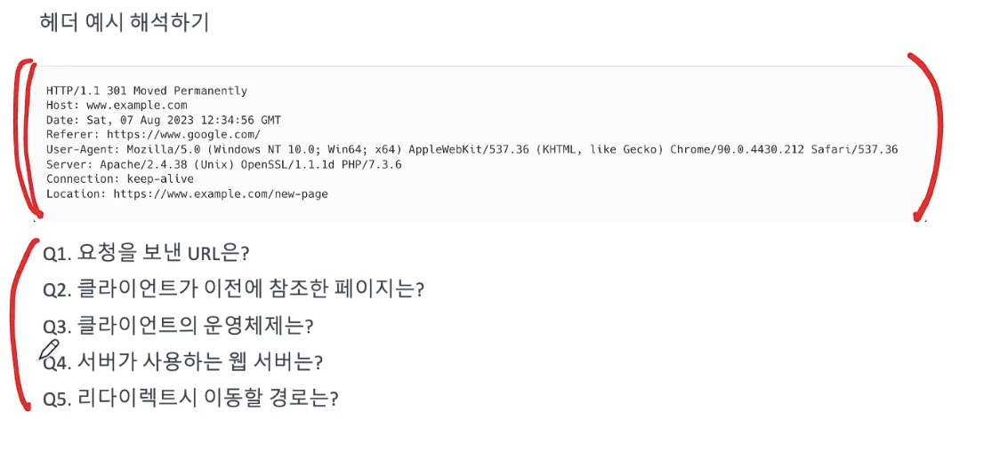

## **Ch 5. 응용 계층**

### **01. DNS**

#### 네트워크 상에서 호스트를 특정 지을 수 있는 주소
- MAC 주소

- IP 주소

- 모든 IP 주소, MAC 주소를 외우기는 힘들어서 도메인 이름과 호스트를 특정지을 주소를 매핑하는 DNS

* 도메인 : 호스트에 부여되는 문자열 이름

##### 계층적 도메인 구조

- .com, .net .. > TLD 서버

    - 인터넷 최상위 도메인 목록

- .co, ac .. 
    
    - Second Level domain

- ...

##### 서브 도메인

- 도메인의 일부인 도메인

    - naver.com > **maps**.naver.com

- 각 도메인을 담당하는 도메인 서버

    - ROOT 네임 서버

    - TLD 서버

    - Authoritative DNS 서버 : 찾고자 하는 도메인의 IP 주소를 저장하는 최종 서버

    - local DNS 서버 : 클라이언트가 가장 먼저 찾는 DNS 서버(DNS Resolver)

        - local DNS 서버 주소 명시적 설정 <- public DNS

        - local DNS 서버 주소 자동 설정 <- ISP

- DNS 서버는 무엇을 저장하고 있을까?
    - DNS 레코드(자원레코드)
        - A 레코드 : 도메인에 대한 IPv4 주소

        - AAAA레코드 : 도메인에 대한 IPv6 주소

        - CNAME 레코드 : ehapdlsdp eogks qufcld

        - NS 레코드 : 네임 서버 주소

        - SOA 레코드 : 도메인에 대한 관리자 정보

- DNS 캐시

    - TTL 기간동안 DNS 저장

### **02. 자원과 자원의 식별**

- URI, URL

##### 네트워크 상에서의 자원
- 네트워크로 주고받을 수 있는 모든 정보

- 파일, 이미지, 동영상, HTML, XML, JSON, ...

- 네트워크 상에서 자원을 요청하고 요청한 자원을 응답하려면 자원을 식별할 수 있어야함

- 자원의 식별자 == Uniform Resource Identifier

- URI는 위치 혹은 이름으로 분류 가능

    - **URL : 위치 기반 자원 식별(Locator)**
        - scheme : 일반적으로 프로토콜 이름 명시 -> HTTPS://

        - authority : [userinfo"@"]host["."prot]
            - 사용자 이름을 이용한 인증 가능 - 생략가능

            - 호스트 이름(도메인 이름 혹은 IP 주소)

            - 포트 번호 - 생략가능

        - path
            - 자원이 있는 경로 - https://github.com/**junyongd**
        
        - query
            - key-value 형태로 서버에 전달할 문자 형태의 파라미터

            - ?로 시작, & 혹은; 로 다수의 query 구분

            - https://www.google.com/serch**?q=1&**

        - fragment
            - 자원의 조각을 가리키는데 사용 (#으로 구분)

    - URN : 이름 기반 자원 식별(Name)

#### URL 해석 연습

- https://www.google.com/serch?q=1#hello

    - https:// - scheme

    - www.google.com - authority

    - serch - path

    - ?q-1 - query

    - hello - fragment

### **03. 웹 서버와 웹 어플리케이션 서버**

- 서버 - 클라이언트
    - 서버 - 서버는 대답하는 대상(respomse)
        - 웹서버

        - 웹 어플리케이션 서버(WAS)

        - 서버가 응답해야 하는 자원 
            - 정적인 자원
                - 언제/어디서/누가 봐도 변하지 않는 정보(HTML,이미지...)

                - 웹서버 (Nginx, apache http server)

            - 동적인 자원
                - 언제/어디서/누가 보는지에 따라 변할 수 있는 정보(주로 사용되는 것이 데이터베이스)

                - 웹 어플리케이션 서버(apache Tomcat)
        
        - 웹 서비스는 웹 서버와 웹 어플리케이션 서버를 둘다 사용
            - 부하방지

            - 보안 상의 이점

            - 여러 웹 어플리케이션 서버 연동 용이

    - 클라이언트는 요청하는 대상(request)

### **04. HTTP의 특성**

- 현재 HTTP의 기본 특성
    - 요청-응답 기반 클라이언트 - 서버 구조 프로토콜
        - HTTP 클라이언트 (HTTP 요청 메세지)

        - HTTP 서버 ( HTTP 응답 메세지)

        - (오해방지: 서버 간에도 HTTP 메세지를 주고받을 수 있음)

    - 미디어-독립적 프로토콜

        - 어떤 형태의 데이터도 HTTP 메세지로 보낼 수 있음(HTML, 이미지, JSON, XML, etc

    - 비연결성 프로토콜

        - HTTP 1.0, HTTP 1.1, HTTP 2.0 은 TCP 기반

        - TCP는 연결성 프로토콜

        - 하지만 HTTP는 비연결성 프로토콜

        - 다수의 클라이언트가 연결을 시도할 경우 연결을 유지하는 동안 서버의 자원 소모가 너무 크다

    - 스테이트리스 프로토콜

        - 서버는 클라이언트의 상태를 기억하지 않는다

        - 왜 스테이트리스 프로토콜일까?
            - 크라이언트가 한 서버에 종속되지 않도록(기억하는 서버)

            - 여러 요청을 보내야 할 경우 여러 서버에 요청을 할 수 있도록

            - (서버의 ip가 바뀌거나 서버에 장애가 있을때를 방지)

            - 서버의 확장이 용이하다
    
    - 지속 연결 프로토콜

        - 연결할 때마다 3-way handshake를 매번 하지 않고 한번 연결을 하면 여러 개의 HTTP 요청/응답 주고받기

HTTP 버전별 특성

- HTTP 0.9 : 단일한 요청 방법(get 메서드), 비지속 연결, 별다른 기능없음

**- HTTP 1.0** : 다양한 요청 방법과 헤더 추가

- HTTP 1.1 : 지속 연결 기능 추가

**- HTTP 2.0** : 요청 순서대로 응답을 반환할 필요 없음, 헤더 압축

- HTTP 3.0 : UDP 기반 피로토콜인 QUIC로 변경

### **05. HTTP의 메세지 개관**

- HTTP-massage = start-line
*( header-field CRLF )
CRLF
[ message-body ]

#### **HTTP 요청 헤더 - Start line**
- **HTTP 메서드** (공백) 요청 대상 (공백) HTTP 버전 (줄바꿈)
    - 서버에게 요청할 동작 (해당 자원으로 어떤 동작을 요청할지)
        - GET : 자원(리소스) 조회, 일반적으로 쿼리 문자열을 사용하되 본문은 없음 

        - POST : 요청할 데이터 처리 (어떻게 처리할지는 서버가 결정(e.g. 새 자원 생성, 가공))

        - PUT : 자원 덮어쓰기, 본분이 있다면 대체, 없다면 생성

        - PATCH : 자원 부분 변경

        - DELETE : 자원 삭제

        - 이외에도 HEAD, OPTIONS, etc
    - [http메세지표](https://ko.wikipedia.org/wiki/HTTP#요약표)
        - 멱등성 : 여러 번 동일한 요청을 보내도 첫 요청 결과와 같은가

        - 캐시 가능성 : 응답 결과를 캐시해서 사용할 수 있는가

#### **HTTP 응답 헤더 - Start line**

- HTTP 버전 (공백) 응답 코드 (공백) 이유 문구 (줄바꿈)
    - 2xx : 성공
        - 200 OK : 요청 성공

        - 201 Created : 요청 성공, 새로운 자원 생성됨 (post)

        - 202 Accepted : 요청 성공, 처리는 아직 미완료

        - 204 not content : 요청 성공, 응답할 데이터 없음

    - 3xx : 리다이렌션 (이 요청을 처리하려면 추가적인 처리가 필요함)
        - 응답의 location 헤더를 통해 특정 위치로 이동

    - 4xx : 클라이언트 오류
        - 401 Unauthorized : 미인증

        - 403 forbidden : 금지된 자원에 접근 (자원에 접근할 권한 없음)

        - 404 not found : 요청한 자원 없음 (공개한 자원이 아님)

    - 5xx : 서버 오류
        -500 internal server error : 서버 오류

        - 503 service unavailable : 현재 이용 불가능

### **05. HTTP 헤더**

header-field = field-name"." field-value
    - 메세지 전송에 필요한 부가 정보

#### **대표적인 헤더 정보**

- host : 요청 호스트에 대한 호스트명 + 포트 정보

- date : 메세지 생성 시간

- referer : 직전에 머물렀던 url

- user-agent : 클라이언트 소프트웨어, 브라우저 명칭과 정보

    - mozilla : 접속한 브라우저가 mozilla와 호환된다 (대부분 포함되어 있는 정보)

    - windows NT 10.0; Win64; x64: 윈도우 10 버전의 64비트 x64 아키텍처 사용한다

    - applewebkit : 브라우저를 렌더링하는 aplle 웹킷 엔진을 사용한다

    - Chrome, Safari : 브라우저 이름과 버전

- server : 서버 소프트웨어 명칭과 정보

- connection : keep-alive 일 경우

- location : 리다이렉트시 이동할 경로

- content-type : HTTP 요청 및 응답에서 사용될 컨텐츠의 유형

    - MIME 타입으로 명시
        - 웹 상에서 컨텐츠의 유형을 나타내기 위한 방법 (<type/subtype>) 형식으로 표기, 웹상에서 확장자 타입

    - text/html; charset=utf-8 : HTML 문서, 인코딩 형식은 utf-8

    - application/json: json 형식 데이터, api request-response에서 주로 사용

    - image/png: png 타입 이미지 데이터

    - text/plain: charset=utf-8 : 텍스트 파일 데이터, 인코딩형식 utf-8

    - application/xml : xml데이터

- content-encoding: : 데이터 인코딩.압축 방식

- content-length : 데이터의 바이트 단위 길이

- content-language : 데이터의 언어

### **08. 캐시**
#### **네트워크에서 캐시란**
- http는 상태를 유지하지 않는다

- 서버의 지연을 줄이기 위해 웹 페이지, 이미지 등의 자원 사본을 임시 저장하는 웹 기술

- 캐시된 자원이 저장되는 공강 : 클라이언트(브라우저) 혹은 특별한 서버(캐시서버, 프록시서버)

#### **cache-control 헤더**
- cache-control 헤더로 캐시 기능을 알린다

- cache-control: max-age=숫자(초) 캐시 자원의 지속시간

- cache-control : no-cache 캐시 가능한 자원이나, 항상 origin 서버에 검증하기

- cache-control : no-store 캐시하면 안될자원

#### **캐시 유효 기간**
- 해당 자원이 언제 마지막으로 변경되었는지를 알리는 Last-modified 헤더

#### **캐시된 자원의 변경**
- 클라이언트는 요청시 if-modified-since 헤더로 특정 시점 이후 자원 변경 여부를 묻는다

- 만일 변경되었다면 다시 다운로드

- 만약 변경되지 않았다면 서버는 304 Not Modified 응답을 보낸다
    -> "자원 변경 안됐으니 캐시로 Redirect 해라"

- etag를 통해 자원의 변경 여부 감지 가능

- 서버는 캐시된 자원이 etag라는 식별 문자를 붙이고, 클라이언트는 if-none-match 헤더를 통해 해당 Etag를 검증

### **09. 쿠키**

#### 쿠키란
- HTTP는 상태를 유지하지 않는 프로토콜

- 서버로부터 받은 정보를 클라이언트 측(웹 브라우저)에 임시 저장되는 이름=값 형태의 데이터

- 유효기간이 있음

- 쿠키를 전송할 도메인과 경로가 정해져 있음

- 서버가 set-cookie 헤더로 쿠키를 전달하면 클라이언트는 쿠키를 저장하여 다음 http 요쳥의 cookie 헤더로 활용

#### 쿠키의 도메인

- set-cookie: domain = example.com
    - example.com(을 비롯한 서브 도메인)에 접근할 때 쿠키 활용

#### 쿠키의 경로

- set-cookie:path =/
    - path에 명시된 경로 하위 경로에서 쿠키 활용

#### 쿠키의 유효기간

- set-cookie:expires=wed,10 Aug 2023 12:00:00 GMT

- set-cookie:max-age=1000(활용가능 시간)

#### 쿠키는 보안에 민감하다

- 쿠키 정보는 탈취당할 수 있어서 주의

#### 쿠키와 세션

- 쿠키의 저장/관리 주체가 클라이언트(브라우저)라면 세션의 저장/관리 주체는 서버

- 서버는 클라이언트 식별할 수 있는 세션 ID를 제공하고, 클라이언트는 서버에게 세션 ID(암호화)를 (쿠키로)0 넘겨 호스트를 식별하게 할 수 있다

#### 쿠키의 보안기능

- secure : https인 경우에만 전송

- HTTPOnly : 자바스크립트에서 접근 불가 (documanet.cooke), XSS 공격방지

### **010. 컨텐츠 협상**

#### 컨텐츠 협상 (contents negotiation)
- 클라이언트가 원하는 컨텐츠를 받을 수 있도록 서버에게 부탁하는 기능

- 컨텐츠 타입, 언어, 인코딩 방법 등 클라이언트 맞춤 컨텐츠 제공 기능

- Accept(-X) 헤더 이용
    - Accept: 클라이언트가 선호하는 컨텐츠 타입

    - Accept-Encoding : 클라이언트가 선호하는 인코딩

    - Accept-Language : 클라이언트가 선호하는 언어

- 여러 맞춤 요청을 보낼 수 있음

    - 여러 맞춤 요청을 보낼 때 Quality Value 값을 기준으로 우선순위를 매길 수 있음

    - 0 <= Quality Value <= 1

    - 클수록 우선순위가 높음
